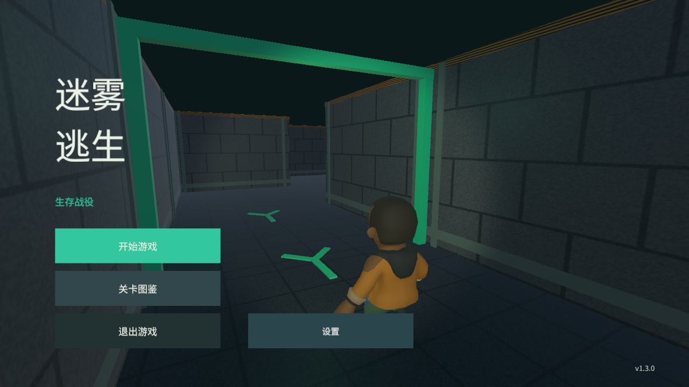
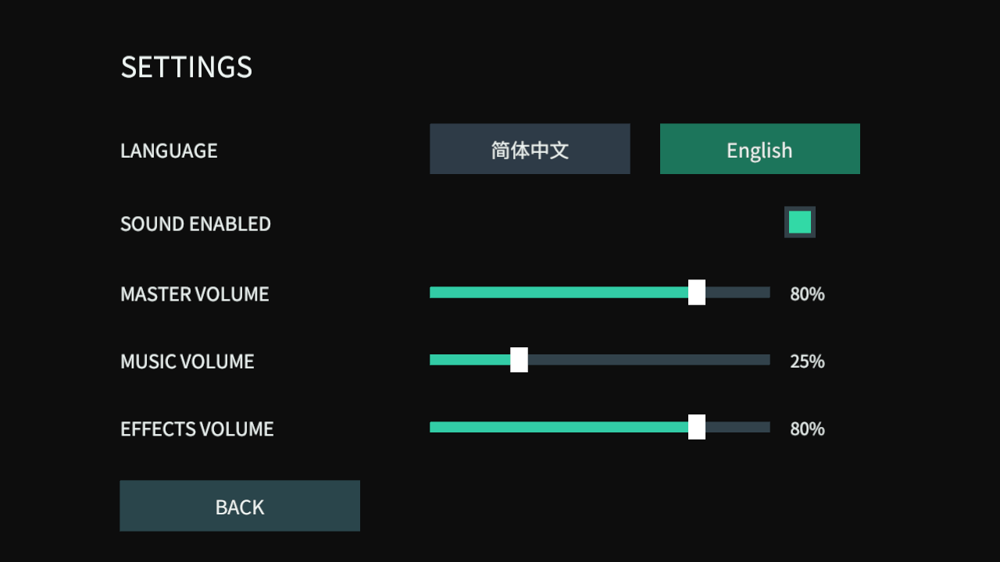

# Fogbound Maze（迷雾逃生）

使用 Unity 6 与 C# 开发、在 AI 辅助下持续迭代的 3D 生存迷宫作品。玩家在迷宫外选择冲锋枪或长刀，从入口进入程序化生成的迷宫，在僵尸追击和环境压力下寻找终点。游戏支持第一/第三人称切换、十关顺序解锁和本地进度保存。

**当前正式版 v1.3.0**：默认简体中文，支持英文切换、静音、总音量、音乐与音效音量，并保留十关迷宫、全图避难灯、装弹反馈和此前的战斗修复。

- [下载 GitHub Release v1.3.0](https://github.com/ff1333/FogboundMaze/releases/tag/v1.3.0)
- [v1.3.0 发布说明](docs/RELEASE_NOTES_v1.3.0.md)
- [v1.3.0 设置与开发记录](docs/13_V1_3_0_SETTINGS.md)
- [v1.3.0 自动测试、平台构建与验收边界](docs/test-results/v1.3.0/README.md)
- [文档阅读入口](docs/README.md)





## 核心玩法

- 十关确定性迷宫，每关使用不同固定种子、尺寸和难度参数
- 开始页、十关选择、机制图鉴、武器选择和本地顺序解锁
- Growing Tree 程序化生成，并筛选路线长度、转弯和分岔质量
- 探索小地图记录走过的区域，不直接暴露完整出口路线
- 第一人称与第三人称切换，共用输入、瞄准和伤害逻辑
- 冲锋枪与长刀两种武器，包含装弹风险、命中反馈和遮挡判断
- 普通与精英僵尸，通过网格 A* 和 Wander / Chase / Attack / Dead 状态行动
- 对象池按关卡敌人上限预热，复用僵尸实例
- 后期关卡逐步加入浓雾、昼夜、瘴气和全图避难灯
- Windows、WebGL、Android 操作与构建支持
- 默认中文，可切换英文；声音开关和分组音量本地保存

## 操作方式

### Windows / WebGL

- `WASD`：移动
- 鼠标：转向和瞄准
- 按住鼠标左键：攻击
- `Shift`：冲刺
- `R`：冲锋枪装弹
- `V`：切换第一/第三人称
- `Esc`：暂停并释放鼠标

### Android

- 左侧浮动摇杆：移动
- 滑动屏幕：转动视角
- 攻击、冲刺、装弹和视角按钮：执行对应动作

## 工程设计

### 程序化迷宫

关卡使用不同固定种子生成，确保每关布局不同，同时让同一问题能够复现。Growing Tree 算法先保证逻辑连通，再通过候选筛选控制路线长度、早期选择点、转弯和分岔密度。PlayMode 还会驱动实体角色沿路线移动，用来发现“逻辑可达但碰撞体挡住入口”的问题。

### 寻路与敌人状态

僵尸复用迷宫逻辑网格执行 A*，不需要在每次生成后重新烘焙 NavMesh。敌人状态将游荡、追击、攻击和死亡拆开；对象回收时重置生命、目标、路径和状态，避免复用污染。

### 相机与战斗

两种视角共享战斗规则。远程攻击先从相机准心确定瞄准点，再从枪口检查真实遮挡，减少第三人称越墙命中。冲锋枪保留装弹脆弱窗口，并在装弹完成后播放提示音和短暂显示 READY；长刀使用距离、角度和遮挡限制近战命中。

### 环境难度

浓雾限制远处视野，昼夜改变照明；瘴气关卡要求玩家在避难灯之间规划路线。灯柱分布在主路、支路和死路，不再等同于出口指示。小地图只记录探索，不直接给出正确解法。

### 本地化与设置

`PortfolioSettings` 管理默认值和 PlayerPrefs，`LocalizedLabel` 负责中英文刷新及中文字体，设置面板提供静音、总音量、音乐与音效音量。静音不会清空原滑块值，重新开启声音后恢复此前音量。

## 当前验证结果

- EditMode：`15/15 PASS`
- PlayMode：`35/35 PASS`
- Windows / WebGL / Android：构建成功，发布附件和 SHA-256 已核对
- Windows：独立 Player 的中文设置、图鉴、武器选择和第一人称 HUD 画面通过检查
- WebGL：Edge 中完成设置、图鉴、选关、选武器、移动、攻击、装弹和暂停交互，未捕获游戏异常
- Android：作者已完成一次 v1.3.0 真实设备基本验收，未发现阻塞发布的问题

详细证据与告警边界见 [v1.3.0 验证索引](docs/test-results/v1.3.0/README.md)。一次真机基本验收不代表多机型兼容、长时间压力、十关手动通关或商店审核完成。

## 项目结构

```text
Assets/
  Art/             CC0 角色、僵尸、武器和项目视觉资源
  Editor/          平台构建脚本
  Scenes/          主场景 Main.unity
  Scripts/         生成、寻路、战斗、相机、UI、设置和存档代码
  Tests/           EditMode 与 PlayMode 自动测试
docs/
  devlogs/         各轮需求、修复和验证记录
  images/          历史版本实际运行截图
  test-results/    各版本测试 XML、截图和构建摘要
```

## 本地运行

1. 安装 Unity `6000.3.18f1` 及需要的平台模块。
2. 使用 Unity Hub 打开仓库根目录。
3. 等待资源导入和脚本编译完成。
4. 打开 `Assets/Scenes/Main.unity`。
5. Console 没有红色错误后，点击 Unity 顶部三角形 Play。

正式包位于 [GitHub Release v1.3.0](https://github.com/ff1333/FogboundMaze/releases/tag/v1.3.0)。Windows ZIP 需要完整解压后运行 exe；WebGL ZIP 需要 HTTP 静态托管；Android APK 为作品集测试分发包。

## 素材与能力边界

- 角色、两类僵尸、武器模型、共享色板和角色动画来自 Quaternius Zombie Apocalypse Kit，采用 CC0 1.0；中文字体采用 SIL OFL 1.1。详情见 [THIRD_PARTY_NOTICES.md](THIRD_PARTY_NOTICES.md)。
- 本项目负责素材集成、玩法、生成、寻路、战斗、UI、测试和交付，不将外部模型宣称为本人建模。
- 当前是单机作品集项目，没有联网同步、服务器、热更新和完整商业化系统。
- v1.2.2、v1.2.1、v1.2.0 和 v1.1.0 文档保留用于展示迭代历史，不代表当前版本。

## 历史版本

- [v1.2.2：避难灯与装弹反馈](docs/12_V1_2_2_LIGHTS_AND_RELOAD.md)
- [v1.2.1：右手武器、命中与遮挡修复](docs/11_V1_2_1_WEAPONS.md)
- [v1.2.0：关卡图鉴与战斗表现](docs/10_V1_2_0_POLISH.md)
- [v1.1.0：开始页、十关选择和动画角色](docs/09_V1_1_0_MENU_AND_CHARACTERS.md)
