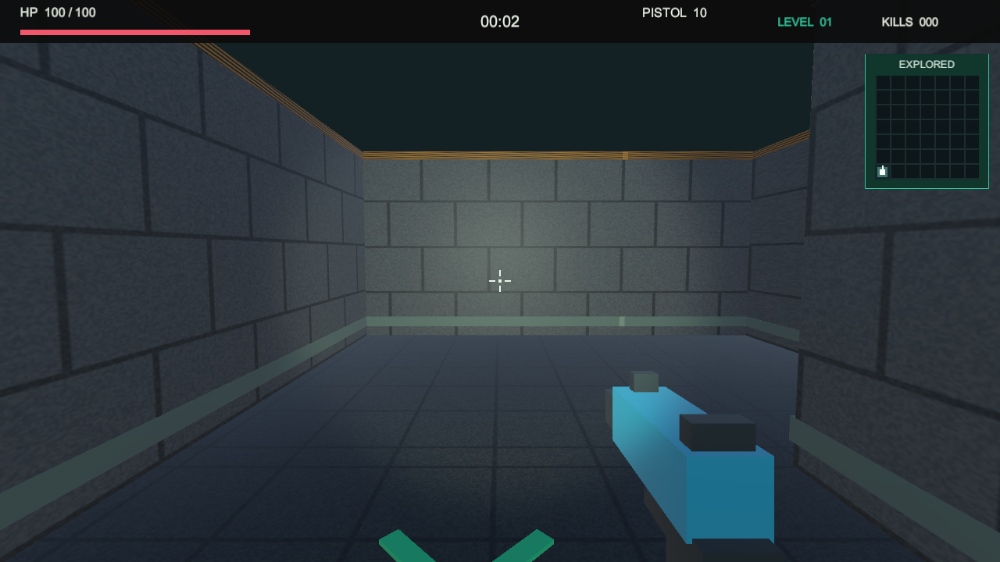
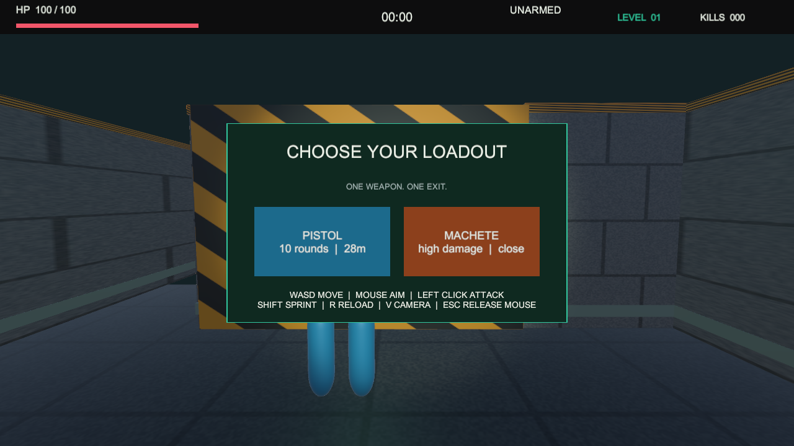
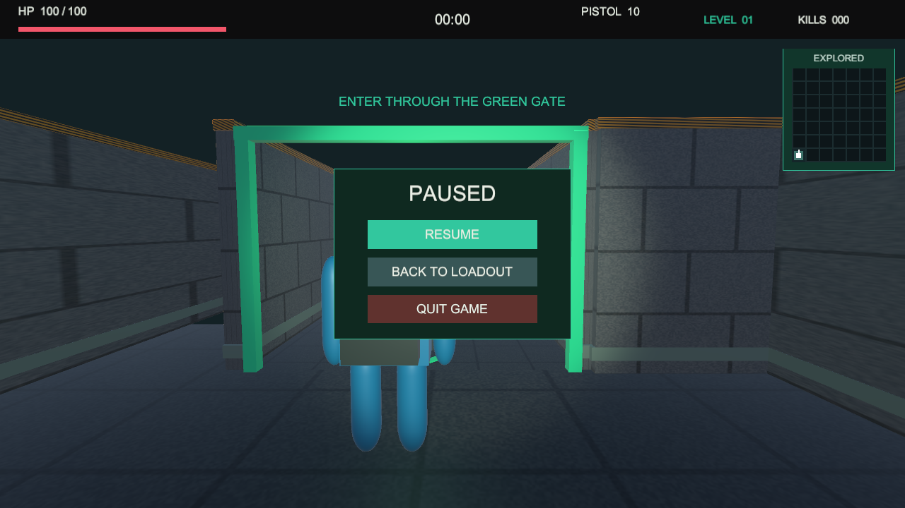

# Fogbound Maze

Fogbound Maze is a Unity 6 third-person and first-person survival maze game.
The player chooses a pistol or machete outside a procedurally generated maze,
enters through the start gate, survives zombie attacks, and reaches the exit.

## Portfolio Scope

- Ten deterministic, progressively harder maze levels
- Runtime maze generation with guaranteed start-to-exit connectivity
- Fog-of-war mini-map that marks visited cells without revealing the solution
- Switchable first-person and third-person cameras
- Ranged and melee weapons with distinct risk/reward
- Grid A* navigation and explicit zombie AI states
- Normal and elite zombie variants backed by object pooling
- Fog, day/night cycling, miasma damage and safe-light zones
- Keyboard/mouse and Android touch controls
- Windows, WebGL and Android release targets

## Technology

- Unity `6000.3.18f1`
- C# and the Unity Input System
- Unity Test Framework

Development evidence, architecture notes, tests and release instructions live
under `docs/`.

## Screenshots

## Release Status

- Local version: `v1.0.2` entrance geometry fix; `v1.0.1` has confirmed blocked corridors and unguarded edges
- EditMode tests: `9/9 PASS`
- PlayMode tests: `13/13 PASS`, including physical routes and every open corridor in all ten levels
- Windows Release Player: continuous six-cell walks in first-person/pistol and third-person/machete `PASS`
- Windows/WebGL builds: `0 errors / 0 warnings`; Android: `0 errors / 5 SDK remote-manifest warnings`
- All three packages generated and SHA-256 verified; WebGL interaction and Android device acceptance remain `PENDING`
- Release attachment directory: `Builds/Packages/v1.0.2/` (ignored by Git)
- Start here: [`docs/README.md`](docs/README.md)
- Playtest bug-fix log: [`docs/devlogs/04-first-playtest-bugfix.md`](docs/devlogs/04-first-playtest-bugfix.md)
- Current regression log: [`docs/devlogs/05-entry-geometry-regression.md`](docs/devlogs/05-entry-geometry-regression.md)
- Current retest and release steps: [`docs/07_V1_0_2_ENTRY_FIX.md`](docs/07_V1_0_2_ENTRY_FIX.md)
