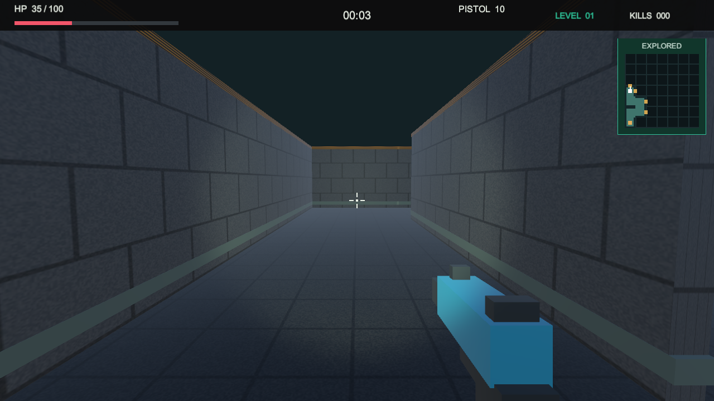
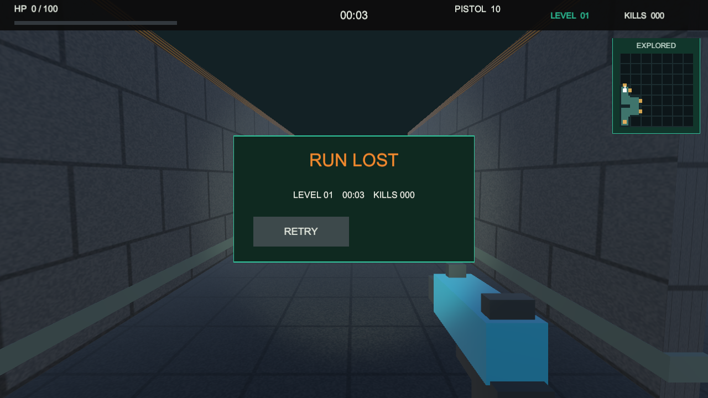

# v1.0.3：血条、死亡显示与岔路优化

这是历史版本记录。当前 v1.1.0 已增加开始页和选关，运行步骤请看 [09_V1_1_0_MENU_AND_CHARACTERS.md](09_V1_1_0_MENU_AND_CHARACTERS.md)。

## 1. 现在从哪里开始

1. Unity 顶部 Play 如果还亮着，先点击停止。
2. 确认工程目录是 `D:\software\documents\unity_games\projects\learning\FogboundMaze`，等待导入和编译结束。
3. 打开 `Assets/Scenes/Main.unity`，重新点击顶部三角形 Play。
4. 选择武器后进入迷宫。每关的种子仍固定，重试同一关不会换地图，但本次更新的十关布局与旧版不同。

不需要你重新摆墙或调整血条组件，它们运行时由代码生成。

## 2. 本次要看什么

1. 让僵尸击中玩家：血量数字下降，粉色血条也必须按比例缩短。
2. 死亡时：RUN LOST 和 HP 0/100 同时出现，粉色血条消失，只留暗色底槽。
3. 点击 RETRY：血量回到 100/100，血条重新满格。
4. 进门后观察路口：最多走 3 格就能遇到第一次选择；分岔不只在快到终点时才出现。
5. 小地图金色短标记表示该路口尚未走过；真正走进后相应格子变成绿色，已走轨迹保留。

第一关有 10 个三岔及以上路口，第十关有 40 个；地图没有提前画出未走区域，不能只凭当前已探索轨迹判断整张地图岔路数量。

## 3. 验证状态

- EditMode 10/10、PlayMode 16/16 PASS；包含十关实体通路回归。
- Windows 正式包：连续走过入口与前六格后，实际验证 35/100 对应 35% 宽度、死亡 0/100 对应 0 宽度，两项均 PASS。
- Windows、WebGL、Android 三平台构建成功，均 0 errors / 0 warnings。
- 三个附件已生成且 SHA-256 校验通过。APK versionName 1.0.3、versionCode 4、ARM64。
- 本版本浏览器交互、安卓真机、用户手动验收：待执行。

开发日志：`devlogs/06-health-hud-and-branching.md`。结构及参数说明：`01_ARCHITECTURE.md`、`02_CAMPAIGN_AND_BALANCE.md`。

实测截图：

## 4. 发布包

附件已放在主工程 `Builds/Packages/v1.0.3/`，无需再次构建：

- Windows：将 `FogboundMaze-Windows-v1.0.3.zip` 完整解压到新目录，再运行 FogboundMaze.exe。
- Android：将 `FogboundMaze-Android-v1.0.3.apk` 发到手机安装，不能沿用旧 APK 的验收结论。
- WebGL：`FogboundMaze-WebGL-v1.0.3.zip` 上传到支持 Unity WebGL 的托管环境再验证。
- `SHA256SUMS.txt` 用于检查附件完整性。

本次不覆盖旧版本附件、不自动推送 GitHub。新版验收后再创建 v1.0.3 Release。
