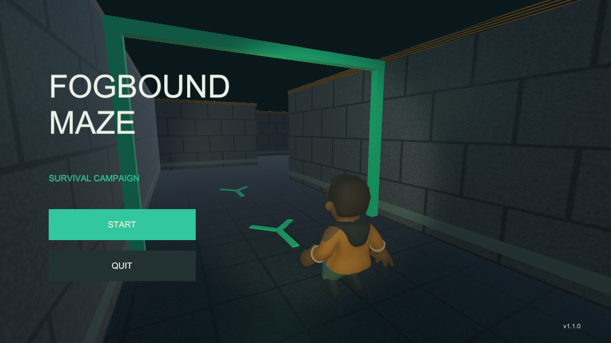
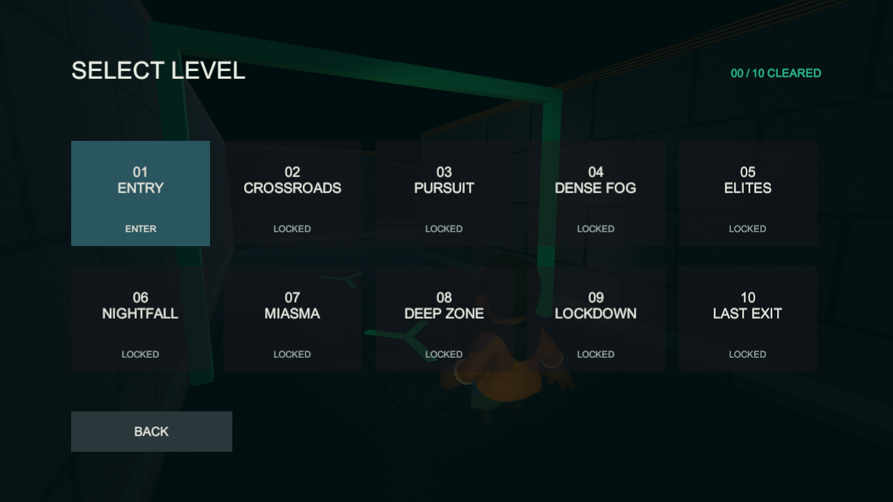
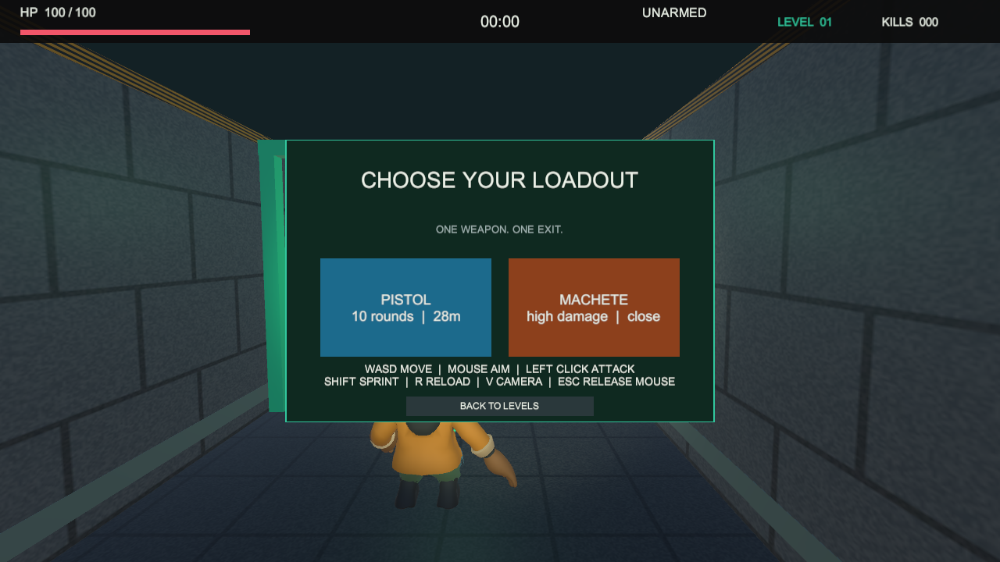
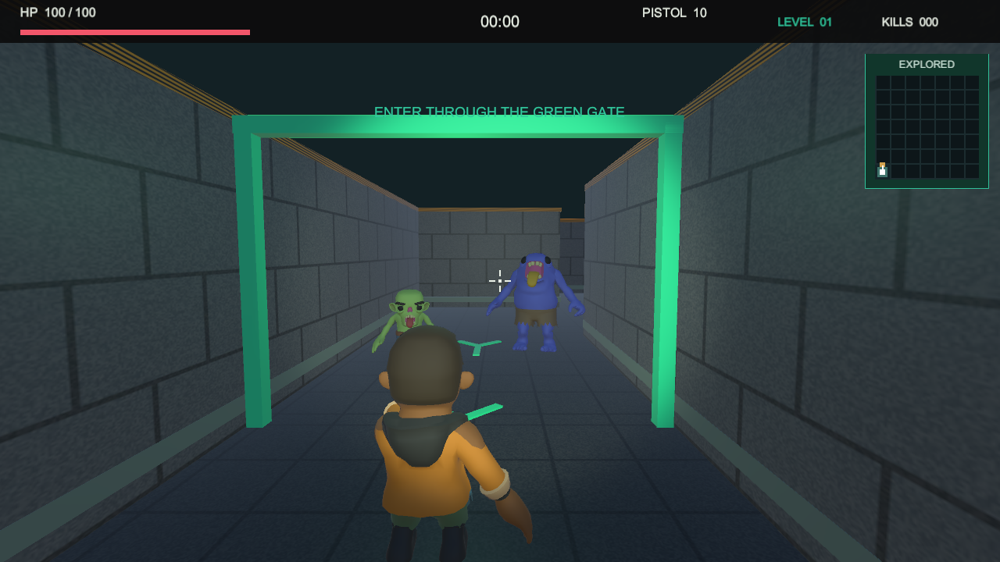
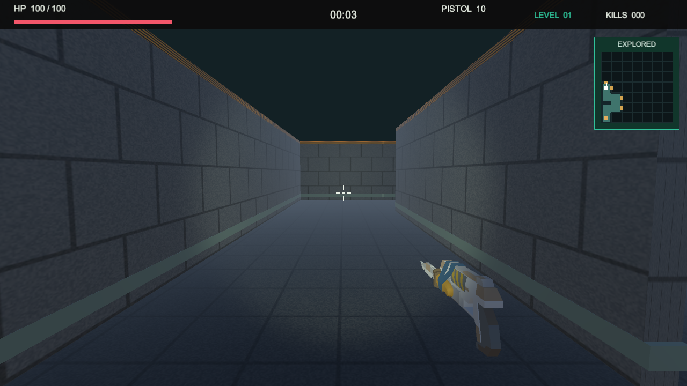

# v1.1.0：开始页、顺序选关与新角色

本次代码、模型、动画及三平台包已生成。你不需要自己下载、拖入模型或重建场景。
先按下面第 1、2 节试玩，再考虑发布。开始界面在运行时生成，编辑状态下只看到 Main 场景是正常的。

## 1. 在 Unity 里打开新版

1. 回到 Unity。如果顶部三角形 Play 亮着，先点它停止运行。
2. 确认打开的是 `D:\software\documents\unity_games\projects\learning\FogboundMaze`，不是名字带 Validation 的验证副本，也不是第一个 2D 工程。
3. 等右下角导入和编译结束。本次新增 FBX 动画，首次导入可能比平时慢。
4. 在下方 Project 窗口依次打开 `Assets > Scenes`，双击 `Main.unity`。
5. 点击 Unity 顶部三角形 Play，切到 Game 标签。现在首先出现下图的开始界面。



6. 用鼠标点击 **START**（开始），出现 1–10 关选择。不是直接选择武器。



7. 没有通关记录时只有 **01 / ENTRY / ENTER** 可以点击；**LOCKED** 表示未解锁，无法进入。
8. 点击 01 后才加载第一关并显示选武器界面。选择 PISTOL（手枪）或 MACHETE（近战刀），然后走过绿色开始门。



9. WASD 移动，鼠标转向，左键攻击，R 换弹，Shift 冲刺，V 切换第一/第三人称。
10. 按 Esc 暂停并恢复鼠标箭头。在暂停或结算界面可以返回选关；武器页也有返回选关按钮；选关页的 BACK 返回开始页。
11. 运行包开始页的 QUIT 退出程序。Unity 编辑器内也可以直接点击顶部 Play 停止。网页版通过关闭标签页退出，没有 QUIT 按钮。

## 2. 解锁规则和需要你确认的体验

这里的规则是“上一关通关后才能首次挑战下一关”，不是“本关必须通关后才能第一次点本关”。

| 操作 | 预期 |
| --- | --- |
| 首次打开 | 只有第一关可进入 |
| 第一关死亡或返回选关 | 第二关仍锁定 |
| 活着到达第一关终点 | 第一关显示 CLEARED，第二关变为 ENTER |
| 退出游戏后重新打开 | 开始页仍先出现，已通关记录保留 |
| 再选已通关关卡 | 可以重玩，不会抹掉此前进度 |
| 通关第十关 | 显示 10 / 10 CLEARED，不出现第十一关 |

如果原来已真正通关过一些关卡，新版会保留旧版解锁进度，不强迫重打。
仅有“上次选了哪关”的旧记录不会解锁关卡。自动烟测截图使用独立空进度，因此截图可能与你的存档不同。

存档使用 **PlayerPrefs**：Windows 为当前用户的本地应用记录，Android 为应用本地数据，WebGL 为浏览器站点存储。
Unity 编辑器和各平台运行包不要假定共用进度；换电脑、换浏览器、清站点数据或清应用数据可能没有原进度。
这不是云存档，也没有账号系统。无需手动寻找或编辑注册表。

## 3. 角色现在是什么样



这张是自动化外观检查截图，为方便比较，把两种僵尸放在入口一起展示；正常游玩仍按关卡规则刷怪。

玩家换成穿外套的生存者，普通僵尸和大型精英有不同体型及面部；角色具备待机、走跑、攻击与死亡动画。
第一人称也换用真实武器网格，原有准心、近战命中、受击反馈及小地图保留。



这是低多边形美术风格，不是写实大作规格；目前第一人称展示武器，没有完整手臂动画。
素材来自 **Quaternius Zombie Apocalypse Kit**，采用 **CC0** 许可，可以使用、修改和随项目发布，不需要购买或额外装建模软件。

- 下载缓存：`E:\CoSoftware\GameAssets\QuaterniusZombieApocalypse`。
- 工程原始素材：`Assets/Art/QuaterniusZombieApocalypse/`。
- 集成后的角色：`Assets/Resources/Characters/`，武器：`Assets/Resources/Weapons/`。
- 许可和来源：[THIRD_PARTY_NOTICES.md](../THIRD_PARTY_NOTICES.md)。

不要把这些模型和原始动画当作自己制作的。面试可以讲导入配置、材质绑定、动画切换、武器挂点和对象池复用。

## 4. 已验证与待验证

- 自动测试：EditMode 10/10、PlayMode 21/21，通过；包括通关保存、锁关、菜单输入、动画和十关实体通路。
- Windows 正式包：开始页、选关、武器页、角色和 854×480 小窗口选关已查看；手枪/刀第一人称各连续走过入口及前六格，通过。
- Windows、WebGL、Android 构建成功，BuildReport 各为 0 errors / 0 warnings。
- **待你确认**：新版 Windows 操作手感、浏览器实际交互，以及新版 APK 在你的 Android 真机上的菜单、触控、动画及通关解锁。

此前版本的真机通过不能代替新版真机验收。详细证据：[开发日志](devlogs/07-campaign-menu-and-character-art.md)。

## 5. 新版包在哪，如何试

资源管理器地址栏粘贴：

```text
D:\software\documents\unity_games\projects\learning\FogboundMaze\Builds\Packages\v1.1.0
```

1. Windows：解压 `FogboundMaze-Windows-v1.1.0.zip` 到单独文件夹，双击其中的 `FogboundMaze.exe`。同目录的 Data 文件夹和 DLL 都要保留。
2. Android：把 `FogboundMaze-Android-v1.1.0.apk` 发到手机并安装，确认菜单、摇杆、攻击和返回正常，再走一次“通关→返回选关→退出重开”检查记录。版本号为 1.1.0，内部版本码为 5。
3. WebGL：`FogboundMaze-WebGL-v1.1.0.zip` 供网页托管使用，不能双击本地 index.html 当作已发布。部署流程参考 `04_BUILD_AND_RELEASE.md` 的 WebGL 部分，把旧版路径换成本目录。
4. `SHA256SUMS.txt` 保存三份附件的校验值，不是游戏，和发布附件一起保留即可。

## 6. 试玩确认后才发布

本轮代码在本地留痕，不会替你在 GitHub 创建正式 Release。
在工程目录打开 PowerShell：

```powershell
Set-Location -LiteralPath "D:\software\documents\unity_games\projects\learning\FogboundMaze"
git status
git log -3 --oneline
git remote -v
```

如果 `git remote -v` 没有输出，表示此工程还没有绑定 GitHub 仓库，不能直接 push。
在 GitHub 创建属于 FogboundMaze 的空仓库（不要勾选 README、gitignore 或 License，因为本地已有文件），
复制 GitHub 显示的 HTTPS 地址，再执行下列命令。把引号中的占位内容换成刚复制的真实地址，不要原样执行占位符：

```powershell
git remote add origin "这里替换为你新建仓库的HTTPS地址"
git push -u origin main
```

如果已有 origin，先确认它确实是此 3D 工程的仓库，不要指向第一个 2D 游戏；已有绑定时不要再执行 `remote add`。
推送命令中的分支名以 `git branch --show-current` 实际显示为准，本轮开始时为 main。

上传完成且新版试玩通过后，在 GitHub 仓库 **Releases → Draft a new release**：

1. Tag 填 `v1.1.0`，Target 选择包含此次修改的分支，通常为 main。
2. Title 填 `Fogbound Maze v1.1.0`。
3. 正文使用 [RELEASE_NOTES_v1.1.0.md](RELEASE_NOTES_v1.1.0.md)，补充实际完成的设备/浏览器试玩情况，不把 PENDING 写成 PASS。
4. 附件区上传 Packages/v1.1.0 中的两个 ZIP、一个 APK 和校验文件。
5. 确认附件上传结束，再点 Publish release。旧版本可保留，不要覆盖旧 Tag。

构建包通过 Release 附件上传；不要为了上传包修改 .gitignore 或把 Builds 加进源码提交。
