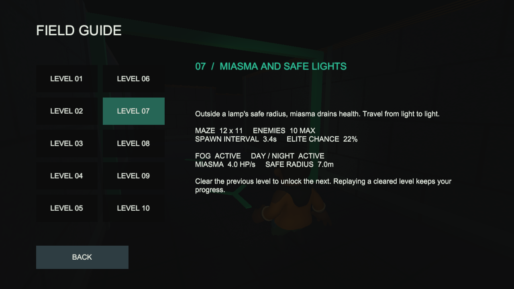
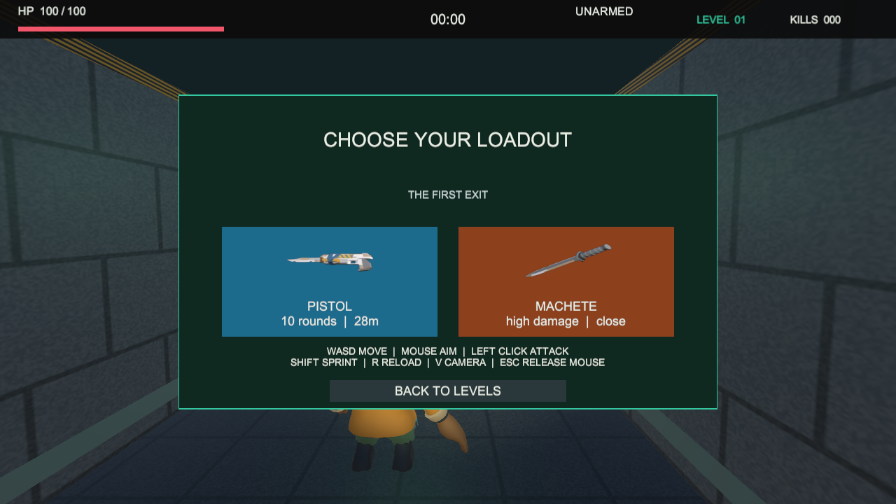
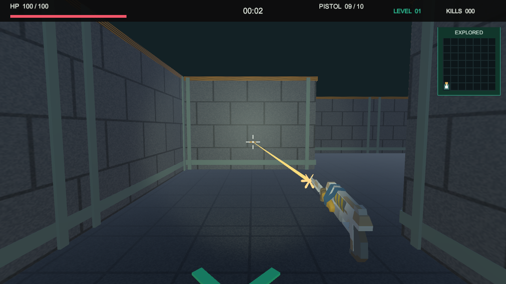

# v1.2.0：现在从这里开始

## 试玩新版

1. Unity 停止 Play，等待编译。打开本工程 `Assets/Scenes/Main.unity`，再点击顶部三角形。
2. 开始页点击 **FIELD GUIDE**：左侧选 01–10，右侧显示该关新增内容和实际配置。尚未解锁也可以阅读，但不能据此跳关。
3. 点 BACK 返回开始页，再按 START → 选关 → 选枪或刀进入。
4. 枪有闪光、弹道、命中火花；命中敌人有 X 和声音，准星会短暂扩张。R 换弹可看百分比和下沉动作。
5. 刀有挥动、弧形刀光及命中反馈。空挥不会扣敌人血，墙后敌人仍受遮挡检测保护。
6. 受伤时屏幕边缘短暂提示；按 Esc 仍能释放鼠标、暂停和返回选关。

## 哪些内容自动接入

菜单、图鉴、特效池和 HUD 都在运行时生成，不用手动添加组件。编辑状态看不到完整运行界面是正常的。
预览图来源于已有 CC0 模型，不需要再下载素材。可用 `FogboundPreviewBuilder.Build` 重新生成枪刀缩略图。

## 包与验证

正式构建附件目录：`Builds/Packages/v1.2.0/`。Windows 完整解压运行 exe；Android 安装 APK；WebGL 通过 HTTP 托管。
自动测试：EditMode 10/10、PlayMode 23/23；Windows 实际 Player 截图与操作烟测见 `test-results/v1.2.0/`。
三平台构建和浏览器状态以该目录的报告为准；新版 Android 真机仍需由持有手机的你确认，不沿用旧版结论。

## 学习与发布

本轮有三轮实施/画面检查/回归记录：[开发日志](devlogs/08-presentation-and-combat-polish.md)。
Release 正文：[RELEASE_NOTES_v1.2.0.md](RELEASE_NOTES_v1.2.0.md)。
两个工程统一的 GitHub 合并、上传附件和简历检查步骤，在工作区根目录 `docs/00_TWO_GAME_V1_2_0_HANDOFF.md`。
