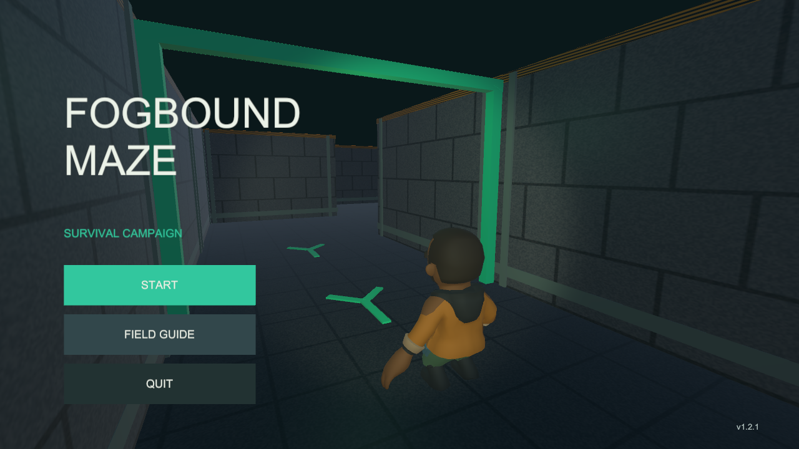
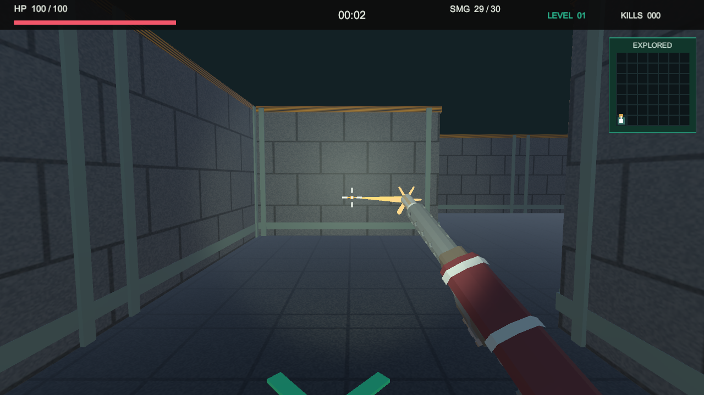
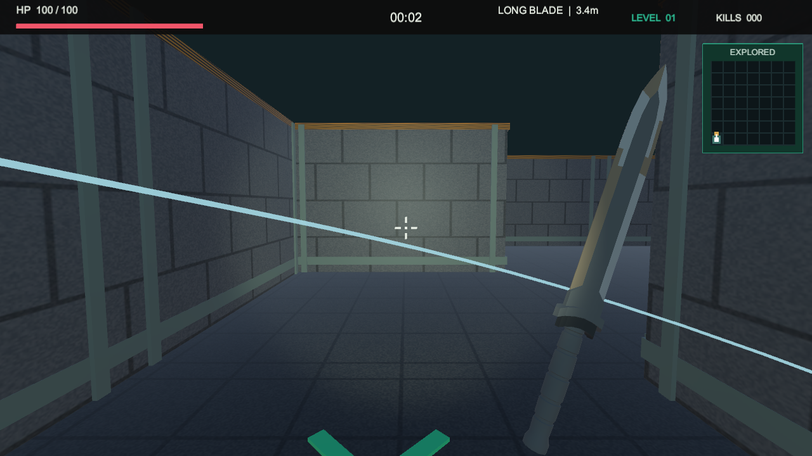

# v1.2.1：右手武器、命中反馈和版本号

日期：2026-10-04。本次来自试玩反馈，接在 v1.2.0 美术迭代之后。

## 先这样运行

1. 在 Unity 点击顶部正在亮着的三角按钮，退出 Play。
2. 等右下角导入、编译结束，打开本工程 `Assets/Scenes/Main.unity`。
3. 再点击 Play。开始页右下角现在应显示 **v1.2.1**。
4. START → 第 1 关 → 选择 SMG 或 LONG BLADE。进关前就能在入口外试武器。
5. 按住鼠标左键持续攻击，R 换弹，V 切换视角，Esc 暂停并恢复鼠标箭头。

如果仍显示 v1.0.1，先停止 Play 并重开这个工程，确认 Unity Hub 中路径是
`D:\software\documents\unity_games\projects\learning\FogboundMaze`。
不要开 Validation 副本或旧版 exe；已经安装的旧 APK 不会随着源代码编辑自动更新。

## 武器发生了什么变化

| 项目 | 冲锋枪 SMG | 长刀 LONG BLADE |
| --- | --- | --- |
| 装备 | 右手 | 右手 |
| 攻击 | 按住连射，约每 0.105 秒一发 | 按住连续挥砍，约每 0.72 秒一次 |
| 单次伤害 | 22 | 70 |
| 弹匣 | 30 发，R 或打空后换弹，约 1.35 秒 | 无弹药 |
| 判定 | 准星确定方向，枪口射线判定，最长 32 米 | 前方 120 度、目标中心水平距离不超过 3.4 米 |
| 遮挡 | 镜头看得到但枪口被挡，也不能穿墙 | 隔墙、身后和范围外均不能造成伤害 |

第三人称保持角色骨骼动画；原素材是左手持械，只镜像视觉模型和动画，使其右手持械。
碰撞体、移动轴和相机输入没有镜像。第一人称是独立的武器显示模型，尚未加入完整手臂与 IK。
长刀沿原刀刃方向加长，第一人称显示比例另作调整，避免挡住准星和大半屏幕。

## 怎样确认真的打中了

准星附近显示 `HIT 22` / `HIT 70` 等实际扣血，击杀显示 `ELIMINATED`。
同时有命中音、火花、短暂闪白和受击停顿；敌人死亡后进入死亡动画。
只打到墙会有墙面火花，没有敌人命中或击杀确认。

冲锋枪使用即时射线判定，黄色弹道是反馈特效，并不是一个缓慢飞行后再计算碰撞的实体子弹。
长刀有约 0.12 秒前摇，然后在挥砍阶段结算；挥空不扣敌人血，切回菜单取消尚未发生的攻击。
同一个敌人有多个 Collider 也只结算一次伤害。

僵尸近距离攻击也增加墙体遮挡检查，避免薄墙另一侧贴近时隔墙扣血。

## 为什么截图曾显示 1.0.1

检查时，两个工程磁盘上的 PlayerSettings 都已经是 1.2.0，3D 开始页读取的是 `Application.version`。
它没有把 `1.0.1` 写死在标题脚本里。截图说明当次编辑器运行值与磁盘配置不一致；
外部改过工程配置后，已打开编辑器或已运行界面仍可能保留旧值。
无法仅凭截图还原当时是哪一次编辑器加载，所以没有将原因写成“发布包肯定打错版本”。

现在 3D 用 `ReleaseVersion` 统一当前版本，导入脚本、进入 Play 和构建前都会同步；
编辑器界面读取 PlayerSettings，正式 Player 读取实际打入包内的 Application.version。
独立 Player 烟测会比较包内版本与代码版本，不一致就报错退出。

2D 已检查且补了相同的编辑器/构建前同步；2D 仍为 1.2.0，不需要仅为了两个数字一样而重发它。

## 验证与发布

EditMode 10 项、PlayMode 31 项通过，包含连射/换弹、近战前摇/距离/遮挡/去重、枪口遮挡和敌人隔墙攻击。
实际 Windows Player 已检查开始、选武器、第一人称枪刀和第三人称右手持枪。
证据在 [验证目录](test-results/v1.2.1/README.md)，开发记录在 [本次日志](devlogs/09-weapons-hit-feedback-version.md)。

新版文件放在 `Builds/Packages/v1.2.1/`；不要把旧 v1.2.0 APK 当成本次新武器版。
GitHub 仍使用尚未合并的 PR #1，分支名 `polish/v1.2.0` 保留不影响发布新版本。
合并后为 3D 创建 `v1.2.1` Release，正文用 [RELEASE_NOTES_v1.2.1.md](RELEASE_NOTES_v1.2.1.md)。
2D 继续按它的 v1.2.0 操作。两款的统一操作入口仍是工作区根目录 `docs/00_TWO_GAME_V1_2_0_HANDOFF.md`。
新版 Android 真机验收仍需实际安装试玩，不能用自动测试代替。
