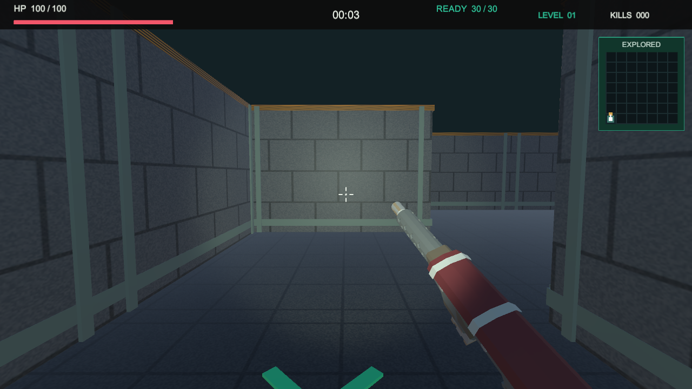
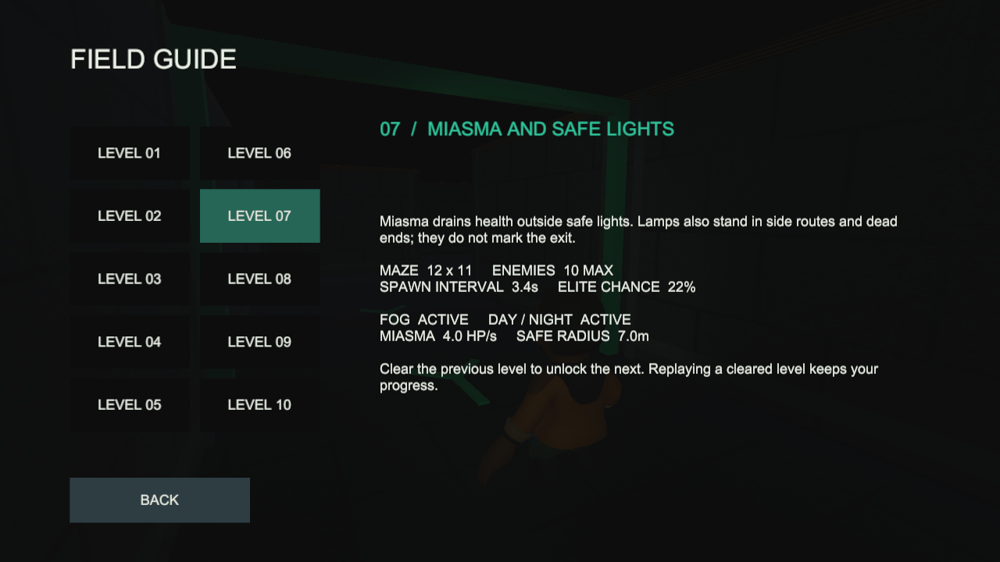

# v1.2.2：避难灯不再指路，装弹结束有反馈

本轮日期：2026-10-04。接在 v1.2.1 右手武器修复后，保留原有战斗系统。

## 你现在怎么查看

1. Unity 中先停止 Play，等待编译完，打开本工程的 `Assets/Scenes/Main.unity`，再点击顶部三角按钮。
2. 开始页应显示 **v1.2.2**。主工程是 `projects/learning/FogboundMaze`，不要打开 Validation 验证副本。
3. START → 选择已解锁关卡 → SMG。先开几枪，再按 R；装弹时弹药栏显示 RELOAD 百分比。
4. 约 1.35 秒后弹匣回到 30 发，响起独立的两段机械声，弹药栏显示绿色 `READY 30 / 30`，约 0.85 秒后恢复普通显示。
5. 继续按住攻击会立即接着开火，READY 因此可能很短，但完成声音仍会播放。按 Esc 暂停会冻结装弹计时。
6. 第 7–10 关观察灯柱：支路和死路也有，不能再一路追着灯找出口。结合小地图记录判断走过的路。
7. 主菜单 FIELD GUIDE → LEVEL 07 中已更新说明。没有解锁第 7 关也能查看图鉴，不会修改通关存档。

手机端保留原触控方式，弹匣打空后继续攻击会自动开始换弹；本次没有改成免装弹连射，
也没有新增有限的背包备弹或弹药拾取系统。新版 APK 仍需在你的手机上试听并验收。

## 规则与实现

- `SafeLightLayout.cs`：关卡种子打乱全图格子，灯柱至少相距两格。入口有一盏避难灯，其余分布不读取终点或解法。
- `MazeWorld.cs`：按生成结果创建灯柱，安全判定仍是水平圆形范围，灯不回血。
- `LevelDefinition.cs`：后四关安全半径从 7 米递减到 6.25 米，让新分布下的直接通行留有生命余量；瘴气伤害不变。
- `ProceduralAudio.cs`：开始装弹和装弹完成使用不同音效；完成音采用两段短机械声。
- `WeaponController.cs`：只有装弹成功才补满弹匣、发声并进入短暂 READY 状态；死亡、回菜单或换武器不会延迟补弹。
- `GameHud.cs`：显示换弹进度和就绪提示。30 发弹匣、1.35 秒装弹、装弹期间不能开火均保留。

具体数值与通行测试表见 [关卡与平衡](02_CAMPAIGN_AND_BALANCE.md)。

## 测了什么

自动测试 49 项通过：EditMode 15 项、PlayMode 34 项。
覆盖灯柱可复现、无重复、范围合法、支路/死路灯、瘴气危险区、默认四关通行耗血；
以及完成补弹、READY 显示/消退、不能装弹时开火、暂停冻结、死亡和换武器取消完成反馈。
原有实体通路、遮挡、长刀、菜单和解锁测试也保留。

最终构建、运行截图、浏览器记录和校验文件统一放在 [验证索引](test-results/v1.2.2/README.md)。
Windows、WebGL、Android 均构建成功，BuildReport 均为零错误、零告警。
Windows Player 和 Edge 实际运行已检查，APK 元数据为 1.2.2 / code 8 / ARM64。
自动检查由工具执行，不写成你本人手测；声效试听、手机手感和长时间战斗仍以实际试玩为准。

## 提交和发布

本次沿用 `polish/v1.2.0` 分支和 [PR #1](https://github.com/ff1333/FogboundMaze/pull/1)，分支名不代表游戏版本。
发布用 **v1.2.2**，不要再传 v1.2.1 包。发布正文见 [RELEASE_NOTES_v1.2.2.md](RELEASE_NOTES_v1.2.2.md)。
资源管理器地址栏打开 `D:\software\documents\unity_games\projects\learning\FogboundMaze\Builds\Packages\v1.2.2`，
其中两个 ZIP、一个 APK 和 `SHA256SUMS.txt` 是本次已生成的最终附件。
两款游戏的合并、附件上传和简历入口仍统一在工作区 `docs/00_TWO_GAME_V1_2_0_HANDOFF.md`。

开发过程见 [本轮日志](devlogs/10-safe-lights-and-reload-feedback.md)。
